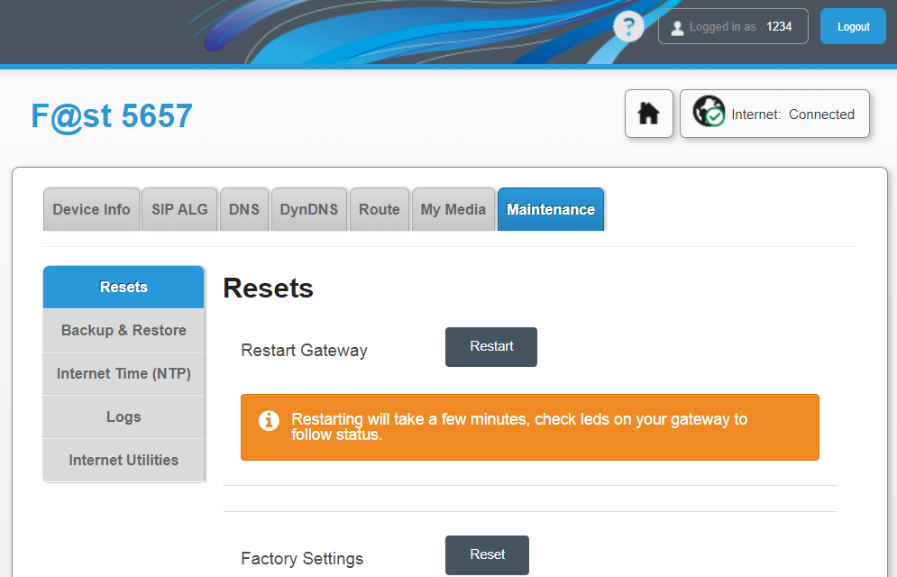

# Obteniendo la *PLOAM password* de un router F@ST 5657

Lo que te voy a contar no es una vulnerabilidad, ni tampoco un fallo de seguridad del operador. No sirve para comprometer routers ni pone en peligro ninguna infraestructura.

Es una forma de acercarse a un problema y trazar un plan con las opciones disponibles, para obtener el resultado deseado. Resultado que se aparta del diseño original del sistema. Es, dicho de otra manera, un relato sobre **hacking**.

## Redes de fibra

La semana pasada me instalaron "la fibra".

Han pasado diez años desde el comienzo en Telefónica de un proyecto llamado FTTH (Fiber To The Home). Consistía en sustituir por fibra óptica el par trenzado de la *última milla*. Sonaba a ciencia ficción por entonces. La fibra estaba reservada a los troncales y redes de enlace especiales. Lo más próximo era ONO, y el bucle de abonado seguía haciéndolo con coaxial.

Al grano, no conozco la redes de fibra. Nunca he trabajando con ellas. Pero parece ser que, a diferencia de las redes de ADSL, para establecer la comunicación con la central se necesita una contraseña de acceso.

Lo primero que hace el instalador tras encender el router es introducir la contraseña. A propósito, si le preguntas por ella quizá te la revele, pero le estás poniendo en un compromiso. Porque con toda seguridad le han ordenado que no lo haga.

Esa contraseña la necesitarás si piensas sustituir el router del operador por uno tuyo. Pero también si se te estropea el actual o sufre algún problema. Sin contraseña no hay conexión, y sin conexión no hay administración remota. Solo queda enviar un técnico a domicilio a reparar la avería.

Quedémonos con que hay un dato desconocido, y vamos a intentar obtenerlo.

## Aproximaciones fallidas

Lo primero es buscar en internet si alguien lo ha hecho antes, por supuesto. Algunos modelos anteriores tenían descuidos evidentes.

El modelo 5655v2, según parece, tenía la [password en la interfaz web][1]. Es un fallo común en formularios web hechos con prisas o sin conocer los componentes. Inaceptable.

Un firmware más reciente del mismo modelo corrige ese fallo y ya no puede obtenerse la contraseña desde la interfaz web. Debe hacerse entrando con una shell al sistema y leyendo el fichero de configuración. Viene deshabilitada, no obstante, pero puede habilitarse mediante [opciones indocumentadas][2] en la web.

Pero en mi modelo, el F@ST 5657, tampoco funciona ya este último método. Habrá que echarle imaginación.

Miramos los **puertos abiertos**. Quién sabe, tal vez la administración por telnet o por SSH está activada de serie. Si bien sería extraño que esté activada pero en la web no aparezcan opciones para desactivarla.

    $ nmap 192.168.1.1 -sV

    Starting Nmap 7.60 ( https://nmap.org ) at 2020-10-24 21:03 CEST
    Nmap scan report for home (192.168.1.1)
    Host is up (0.0035s latency).
    Not shown: 845 closed ports, 148 filtered ports
    PORT      STATE SERVICE     VERSION
    53/tcp    open  domain      dnsmasq 2.78
    80/tcp    open  http        lighttpd
    139/tcp   open  netbios-ssn Samba smbd 3.X - 4.X (workgroup: HOME)
    443/tcp   open  ssl/http    lighttpd
    445/tcp   open  netbios-ssn Samba smbd 3.X - 4.X (workgroup: HOME)
    5060/tcp  open  sip?
    49153/tcp open  upnp        Portable SDK for UPnP devices 1.6.18 (Linux 4.1.51-5.02L.05; UPnP 1.0)
    Service Info: OS: Linux; CPE: cpe:/o:linux:linux_kernel:4.1.51-5.02l.05

No parece. El DNS (80), la web de administración (80), la web por https (443), compartir ficheros (139 y 445), el teléfono (5060) y el uPnP (49153). Quizá alguno de los servicios tenga exploits conocidos. Pero vamos a seguir mirando.

**Descarga de la configuración**. Vamos a lo fácil. Hago un backup de la configuración por puedo ver la contraseña directamente. O tal vez podría manipular el backup para activar una shell cuando lo cargue.

![img-aead10][img/aead10.png]

No es texto, es un fichero binario. Quizá comprimido, cifrado o las dos cosas. AEAD me recuerda a *authenticated encryption with associated data*, prefiero buscar otro camino.

## El CWMP, más conocido por TR-069

CWMP son las siglas de *CPE WAN Management Protocol* y CPE, a su vez, las de *Customer Premises Equipment*. Igual te suena más por EDC: Equipo en Domicilio del Cliente.

Son equipos propiedad de la compañía suministradora pero que están en tu casa. Como tu router.

Cuando tienes una red con decenas de miles equipos deslocalizados en casa del cliente te interesa tenerlos lo más controlados posible, configurarlos desde el mismo punto y recibir información periódica sobre su estado y la conexión. Marca, modelo, número de serie, versión del firmware, atenuación, parámetros de sincronización y hasta la temperatura.

Hay un cacharro que se llama ACS (*Auto Configuration Server*) al que se conecta el router nada más enchufarlo a la fibra o el ADSL. Este le sirve la configuración necesaria. Entre otras cosas, le cambia la contraseña de administrador y a ti te deja un usuario más o menos restringido. ¿Te suena?

En parte para que el cliente no toque donde no sabe, se quede sin conexión y te llame culpándote de ello.

El ACS te sirve para hacer diagnóstico remoto de las incidencias. Si un cliente te llama diciendo que no tiene internet, puedes confirmarlo rápidamente mirando en el sistema su último estado: qué router tiene, hace cuanto que se lo pusieron, si está on-line o cuándo fue su último informe periódico.

También puedes reiniciárselo remotamente, subir y bajar ficheros, o actualizar el firmware.

¿Y, a nosotros, nos puede servir para algo?

## Ganar admin

Lo primero es ser usuario administrador del router. Ya que desde el usuario 1234 las opciones del TR-069 no aparecen.

Tampoco se puede modificar ni ver llamando a métodos de la web.

La forma más fácil para ganar admin en estos routers es reiniciar a valores de fábrica. La PLOAM Password se debería conservar en un espacio aparte. Sin embargo, existe la posibilidad de en el proceso se borre. Con lo que te quedarías sin Internet y toca llamar.

[1]: https://bandaancha.eu/foros/extraer-gpon-router-sagemcom-fast-5655v2-1731346

[2]: https://naseros.com/2020/07/14/como-extraer-clave-gpon-y-sip-del-sagemcom-fast-5655v2-de-masmovil-pepephone-y-yoigo/

